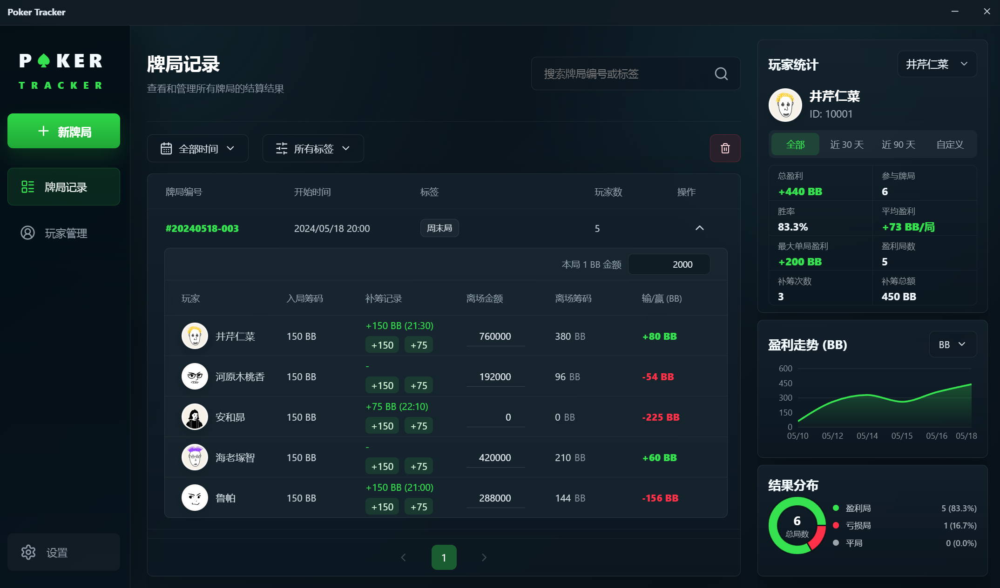
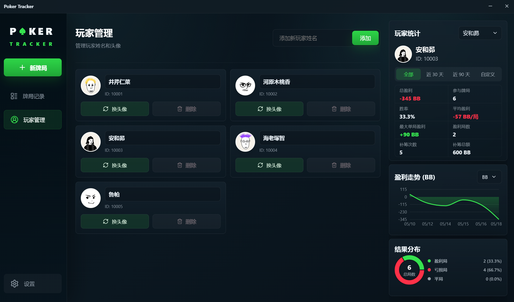
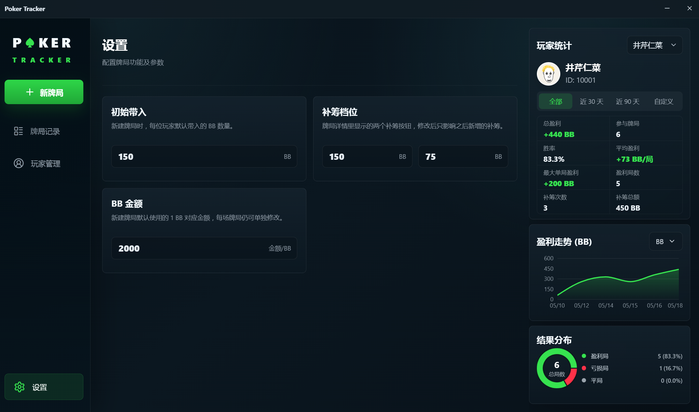

# Poker Tracker

一款给朋友局准备的德扑计分桌面软件。

不用再靠群聊截图、备忘录和心算收尾。谁入局、谁补筹、谁最后带走多少，全部放进一个清清爽爽的窗口里。打完一局，盈亏、走势、结果分布自然算好，复盘的时候也不用翻旧账。



## 为什么会想用它

- 朋友局最烦的不是打牌，是结束后对账。这个软件把“入局、补筹、离场、盈亏”都变成一行行记录。
- 离场金额直接录入，系统自动按 `离场金额 / 2000 = 离场筹码 BB` 换算，再算出每个人的输赢。
- 标签可以按「周末局」「新人局」「练习局」这样管理，之后想找某类牌局会很顺。
- 数据只在本地保存，没有登录、没有云同步，更适合小圈子自己用。

## 核心体验

### 牌局记录，一眼清楚

新建牌局时选玩家、选标签；牌局展开后可以直接记录补筹和离场金额。右侧统计会跟着当前筛选结果变化，想看某个人最近的走势也很直观。


### 玩家管理，够用就好

玩家页只做必要的事：新增玩家、改名字、换头像、删除没有可见历史牌局的玩家。不做复杂档案，不把一个计分工具变成管理系统。



### BB 参数，可按你的局调整

默认初始带入是 `150 BB`，补筹档位是 `150 BB` 和 `75 BB`，`1 BB` 对应金额也可以配置。如果你们局的规则不同，可以在设置页直接改，之后新牌局会按新的参数走；单场牌局也能单独调整自己的 BB 金额。



## 适合谁

- 经常打德扑朋友局，想把结算流程变简单的人。
- 想保留每场牌局记录，但不想上复杂云端系统的人。
- 喜欢清爽桌面工具，希望界面固定、信息密度刚好的人。

## 本地运行

```bash
npm install
npm run dev
```

开发服务器启动后，可在浏览器中打开 Vite 输出的本地地址。

## 启动桌面应用

```bash
npm run desktop
```

该命令会先构建 Web 资源，再启动 Electron 桌面窗口。

## 打包发布

```bash
npm run desktop:pack
```

打包产物会输出到 `release/` 目录。当前配置面向 Windows，产物类型为 portable 可执行文件。

## 数据说明

- 数据保存在本机浏览器/Electron 的 `localStorage` 中。
- 首次启动且本地没有存档时，应用会加载一份虚构示例数据，包含 5 位示例玩家和 6 场示例牌局。
- 示例数据会在首次启动后保存为本地数据；之后再次启动仍会显示，除非用户自行编辑、隐藏、删除或清空应用数据。
- 当前版本不包含登录、云同步或多人共享数据。
- 清理应用数据或更换运行环境可能导致本地记录不可见，请在重要牌局前自行确认数据环境。

## 版本

当前版本：`v0.1.1`
